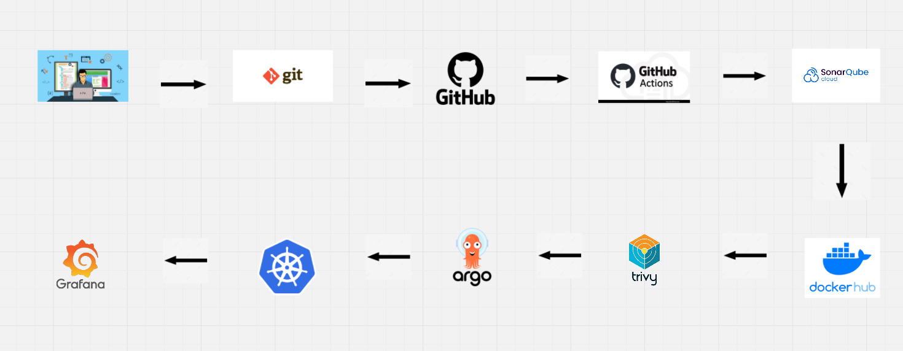

# Pipeline Pirates 🏴‍☠️

**Pipeline Pirates** is a demo full-stack application showcasing a FastAPI backend, a static frontend served by Nginx, containerized deployments, and a Helm chart for Kubernetes/Minikube. This repository includes local developer tooling, security scanning artifacts, and deployment automation for a small but realistic app.

---

## Table of Contents
- Project overview
- Quick start (local with Docker Compose)
- Minikube + Helm (cluster deploy)
- Project structure (key files)
- Backend details (API, auth, DB)
- Frontend details (static SPA, Nginx)
- Configuration & secrets
- Security & dependency management
- Building, signing, and pushing images
- Testing, linting, and scanning
- Troubleshooting & useful commands
- Contributing

---

## Project overview
- Backend: FastAPI application that provides authentication endpoints (`/api/signup`, `/api/signin`) and health checks (`/health`, `/version`). See `backend/app/`.
- Frontend: Single-file static site (`frontend/index.html`) served by Nginx (see `frontend/nginx.conf`).
- Deployments: Docker Compose for local composition (`docker-compose.yml`) and a Helm chart under `helm-chart/` for Minikube / Kubernetes.
- Security: Dependencies and scan outputs are tracked under `securitytests/` along with helpful commands in `securitytests/securityCommand.txt`.

---

## Quick start — Local (Docker Compose) ✅
1. Build and run:
   - docker-compose up --build
2. Open:
   - Frontend: http://localhost:8080
   - Backend (direct, for debugging): http://localhost:8000
3. Useful local DB access (if using Postgres from the compose file):
   - `kubectl` or `psql` access instructions are in `apprunCommand.txt` and `docker-compose.yml`.

---

## Minikube + Helm (recommended for cluster emulation) 🚀
- Use the convenience script: `./start-pirates.sh` — it starts Minikube, creates namespaces, deploys the DB, and applies the Helm chart in `helm-chart/`.
- Key templates:
  - Chart values: `helm-chart/values.yaml`
  - Backend deployment/service: `helm-chart/templates/backend/deployment.yaml` and `.../service.yaml`
  - Frontend deployment/service/ingress: `helm-chart/templates/frontend/*`
  - Secrets template: `helm-chart/templates/secrets.yml` (stores `secret-key` and DB password)
- The ingress rewrite for API paths is implemented in `helm-chart/templates/frontend/ingress-api.yaml`.

---

## Project structure (high level) 🔧
- `backend/`
  - `app/` — FastAPI app: `main.py`, `auth.py`, `database.py`, `models.py`, `schemas.py`
  - `requirements.txt` — production deps
  - `Dockerfile` — multi-stage container
- `frontend/`
  - `index.html`, `nginx.conf`, `Dockerfile`
- `helm-chart/` — Helm chart and templates
- `securitytests/` — scan outputs and scanning instructions
- `docker-compose.yml`, `start-pirates.sh`, `apprunCommand.txt` — local orchestration helpers

---

## Backend details 🧭
- Main entry: `backend/app/main.py` — registers endpoints and middleware (CORS). Endpoints of interest:
  - `GET /health` — health check
  - `GET /version` — API version info
  - `POST /api/signup` — create user
  - `POST /api/signin` — login, returns JWT
- Authentication: `backend/app/auth.py`
  - Password hashing: `passlib` (bcrypt)
  - Token creation: `create_access_token` using `pyjwt` (configured via `SECRET_KEY` environment variable)
- Database: `backend/app/database.py`
  - Default: local SQLite (`sqlite:///./test.db`) if `DB_TYPE` env var is not `postgres`.
  - For production, set `DB_TYPE=postgres` and provide `DB_USER`, `DB_PASSWORD`, `DB_HOST`, `DB_NAME` via env or Kubernetes Secret.
  - `get_db()` yields session objects for dependency injection.
- Model: `backend/app/models.py` — `User` model (id, username, hashed_password)
- Schemas: `backend/app/schemas.py` — `UserCreate`, `UserResponse`, `Token`

---

## Frontend details 🎨
- UI implemented in `frontend/index.html` (vanilla JS). It toggles between Sign In and Sign Up flows and POSTs to `/api/signin` and `/api/signup` when running under the Helm ingress, or to `/signin`/`/signup` when proxied by the local Nginx in `frontend/nginx.conf`.
- Nginx (local image) configuration listens on 8080 and proxies requests matching `^(signup|signin|health|version)$` to the backend container in Docker Compose (`pirates-backend:8000`).
- Helm ConfigMap `helm-chart/templates/frontend/configmap.yaml` provides alternative routing logic used in the cluster deploy.

---

## Configuration & Secrets 🔐
- Environment variables used by backend:
  - `DB_TYPE`, `DB_USER`, `DB_PASSWORD`, `DB_HOST`, `DB_NAME` — database config
  - `SECRET_KEY` — JWT signing key (do NOT hardcode in production)
- Helm stores secrets via `helm-chart/templates/secrets.yml` (base64-encoded values set from `values.yaml` or via Helm CLI arguments or CI)
- In Docker Compose for local dev, a fallback `SECRET_KEY` is set in `docker-compose.yml` — change before exposing to public networks.

---

## Security & dependency management 🔒
- Dependencies: `backend/requirements.txt` (upgraded to address known CVEs). `requirementsOld.txt` is kept for reference.
- Recommended tools for local scanning:
  - `ruff` (linting), `bandit` (security analyzer), `safety` (dependency CVE checks), `trivy` (image scanning)
  - Example workflow (see `securitytests/securityCommand.txt`): create venv → install tools → run `ruff`, `bandit -r backend/app`, `safety check -r backend/requirements.txt`.
- Container signing: `cosign` usage documented in `cosignCommands.txt` — generate key pair and sign images before pushing to registry.

---

## Building and pushing images 📦
- Build locally (example):
  - Backend: `docker build -t <registry>/pipeline-pirates:backend-<tag> -f backend/Dockerfile backend/`
  - Frontend: `docker build -t <registry>/pipeline-pirates-frontend:<tag> -f frontend/Dockerfile frontend/`
- Push to registry and optionally sign with `cosign` (see `cosignCommands.txt`).
- Helm deployments can be pinned to image digests for reproducibility by setting `image.digest` in `helm-chart/values.yaml`.

---

## Testing, linting, and CI ⚙️
- Lint: `ruff check backend/app`
- Security scan: `bandit -r backend/app`
- Dependency check: `safety check -r backend/requirements.txt`

---

## Useful commands & troubleshooting 🧰
- Start Minikube & tunnel (as in `apprunCommand.txt`):
  - `minikube start && minikube tunnel`
- Port-forward ArgoCD / Grafana (see `apprunCommand.txt`).
- Check pods and rollout:
  - `kubectl get pods -n pirates-backend-ns`
  - `kubectl rollout status deployment/<release>-backend -n pirates-backend-ns`
- If auth fails: verify `SECRET_KEY` is consistent across services and not changed unexpectedly.
- Database: verify `DB_TYPE` and connection vars; for local debug switch to SQLite by omitting DB envs.

---

## API Reference (examples) 🧾
- Health:
  - `GET /health` — returns 200 with a health message
- Version:
  - `GET /version` — returns version info
- Sign up:
  - `POST /api/signup`
  - Body: `{ "username": "alice", "password": "s3cret" }`
  - Response: `200` with `{ "username":"alice", "msg": "..." }`
- Sign in:
  - `POST /api/signin`
  - Body: `{ "username": "alice", "password": "s3cret" }`
  - Response: `200` with `{ "access_token": "<jwt>", "token_type": "bearer" }`

> Note: The exact response fields and status may change as you extend the project. Refer to `backend/app/schemas.py` for the canonical Pydantic schemas.

---

